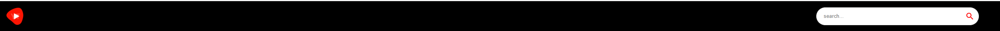
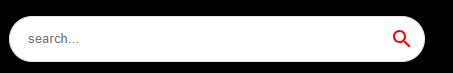
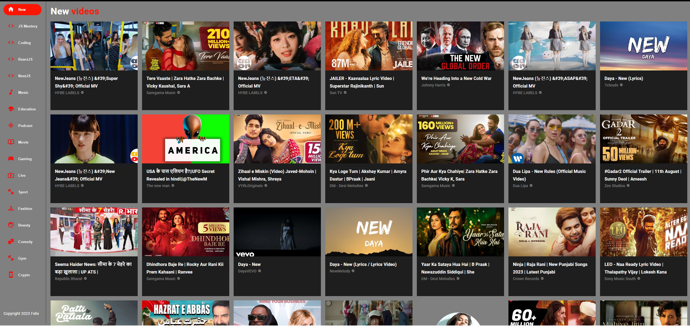
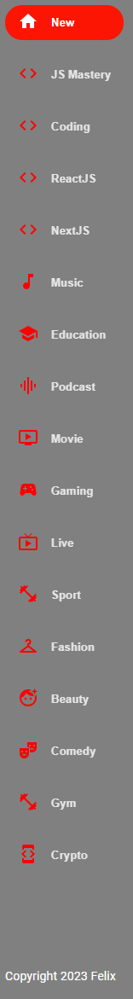
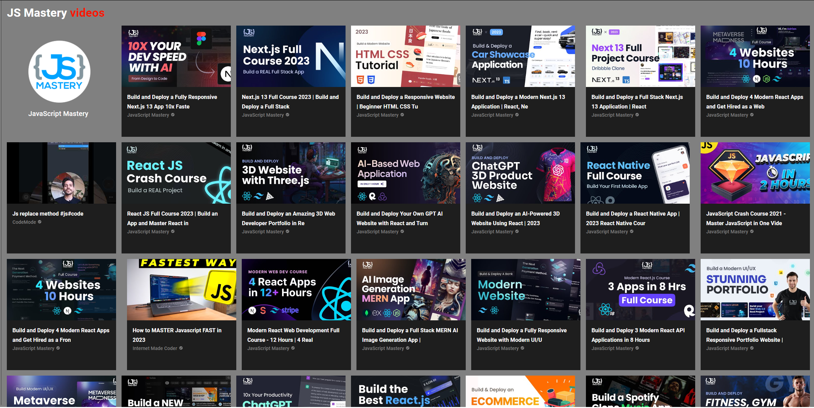
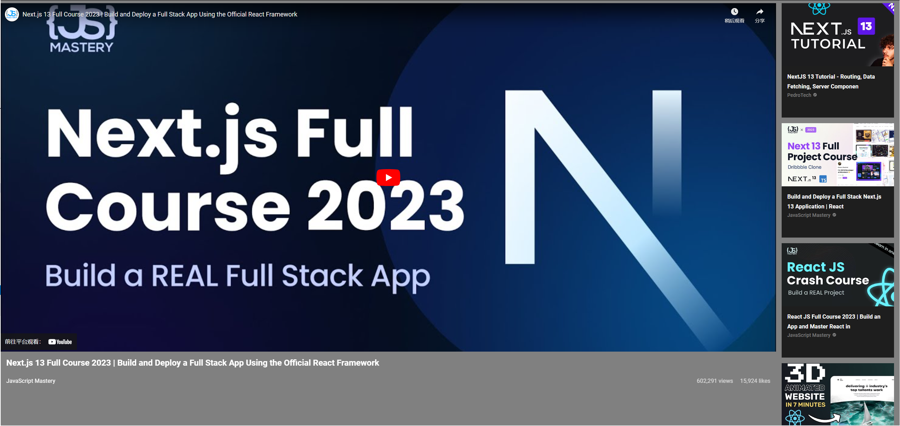
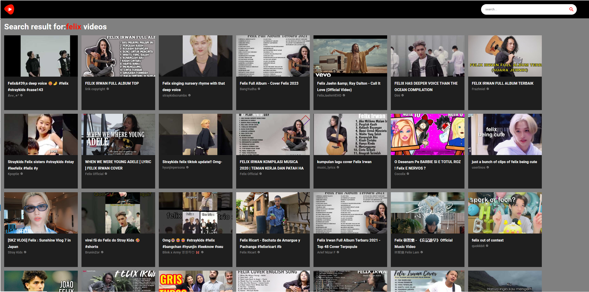
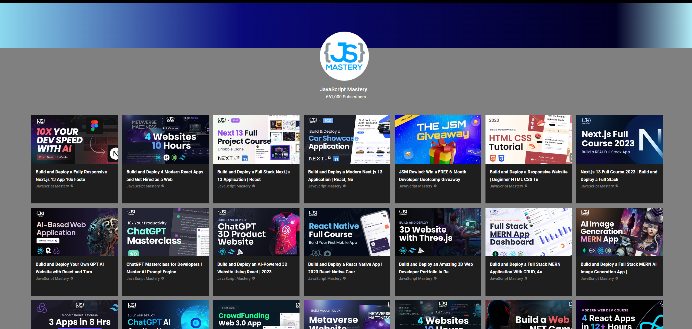
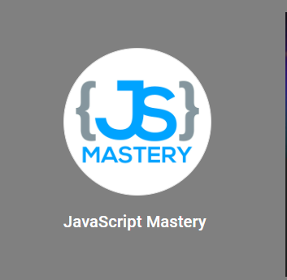

Part I:
Initiate the app:

1. F:\reactjs\javascriptmastery\youtubeapp>npx create-react-app ./

2. Add dependencies in package.json

"dependencies": {
"@emotion/react": "^11.10.0",
"@emotion/styled": "^11.10.0",
"@mui/icons-material": "^5.8.4",
"@mui/material": "^5.9.3",
"axios": "^0.27.2",
"react": "^18.2.0",
"react-dom": "^18.2.0",
"react-player": "^2.10.1",
"react-router-dom": "^6.3.0",
"react-scripts": "^5.0.1"
},"devDependencies": {
"@babel/plugin-proposal-private-property-in-object": "^7.21.11"
}

3. Install dependencies

F:\reactjs\javascriptmastery\youtubeapp>npm install --legacy-peer-deps

4. Add font and icons

F:\reactjs\javascriptmastery\youtubeapp>npm install @fontsource/roboto

F:\reactjs\javascriptmastery\youtubeapp>npm install @mui/icons-material

5. Add css link to public/index.html

<link
  rel="stylesheet"
  href="https://fonts.googleapis.com/css?family=Roboto:300,400,500,700&display=swap"
/>

6. Delete all the content in the src folder and create index.js and App.jsx

7. Start the server
   F:\reactjs\javascriptmastery\youtubeapp>npm start

Part II:
NavBar: The top banner bar.

SearchBar: Search videos, used in NavBar components.

Feed: Used for the whole layout. SideBar component is for left side of the layout. Video component is for the right side.

SideBar: Used for left menu of whole layout

Video: Used for displaying ChannelCard component and VideoCard component in one page.

VideoCard: Used for displaying the content in a Video component.

VideoDetail: Used for displaying the details of one video, including playing the video, displying specific information.

SearchFeed: Display the search result.

ChannelDetail: Display the content of one's channel, including the logo of channel, videos.

ChannelCard: Display the content in a Video component.

Part III:
The functions and technologies are being used in the demo:
useState
useEffect
useParams
axios
.env
BrowserRouter,Routes,Route,
RapidAPI----- rapidapi.com register and log in. then search “Youtube v3”
mui
